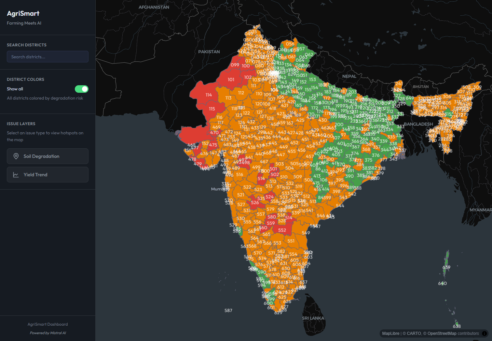

# AgriSmart

AgriSmart is a full-stack agricultural intelligence dashboard for exploring climate, soil, water, crop, and policy risk across Indian districts. It combines an interactive geospatial UI with a TypeScript Fastify API, deterministic scoring services, local reference data, and an optional, explicitly enabled Mistral adapter. The default installation is offline and makes zero provider calls.

The project is designed to demonstrate production-minded engineering in a public portfolio repo: clear separation between UI, API, domain logic, infrastructure adapters, validation, tests, CI, and security-sensitive AI integration.

## Product Screenshot

Real local product run with the Vite client, Fastify API, MapLibre, deck.gl district layers, and committed public fixture data.



## What It Does

AgriSmart helps users inspect district-level agricultural risk and compare interventions:

- Explore India district boundaries on an interactive MapLibre and deck.gl map.
- Color districts by degradation risk and toggle soil or yield hotspot overlays.
- Open a district "Digital Twin" panel with health scores, climate indicators, crop profile data, and charts.
- Compare baseline, current, and 2050 climate horizons for supported district fixtures.
- Generate crop recommendations using deterministic agronomic constraints and scoring.
- Upload CSV or XLSX policy sheets, run deterministic checks when the schema matches, and request AI-generated cabinet-style briefs.
- Export generated policy briefs as PDFs.

## Recruiter-Facing Engineering Signals

- **Clean architecture on the API side:** routes call application use cases through a dependency container; domain services remain pure and testable.
- **Typed backend:** Fastify, TypeScript, Zod configuration parsing, typed DTOs, and explicit domain entities/value objects.
- **Modern geospatial frontend:** React 18, Vite, MapLibre GL, deck.gl layers, client-side state context, resilient fetch fallbacks, and focused UI components.
- **AI integration without key exposure:** all Mistral calls are routed through the server; browser code never needs provider credentials.
- **Quality gates:** workspace-level linting, Vitest tests for client and server domain logic, build verification, npm audit script, and GitHub Actions CI.
- **Honest prototype boundaries:** committed data is intentionally fixture-backed for several advanced features, with a clear path to broader datasets.

## Feature Overview

| Area | Current implementation |
| --- | --- |
| Map exploration | React map scene with MapLibre base map, deck.gl GeoJSON district layers, text labels, degradation coloring, hover tooltips, and hotspot overlays. |
| Land intelligence | District health scoring for soil, water, climate, crop sustainability, and overall health. Includes time horizon UI, charts, and optional AI narrative generation. |
| Crop matchmaker | Server-side crop filtering and ranking based on temperature tolerance, pH range, groundwater stress, water efficiency, profit band, drought tolerance, and companion planting rules. |
| Policy simulator | Browser CSV/XLSX parsing, dynamic schemas, deterministic red flags for known policy columns, policy arbitrage, roadmap generation, AI analysis, polishing, modal review, and PDF export. |
| AI workflows | Mistral-backed endpoints for land narrative, crop rationale, policy brief/freeform policy analysis, and time-travel climate snapshots, with deterministic or local fallbacks where implemented. |
| Operational API | Health check, request IDs, structured Pino logging, CORS controls, rate limiting, validation errors, and centralized error handling. |

## Architecture

```text
Browser
  React + Vite
  MapLibre + deck.gl
  CSV/XLSX parsing + PDF export
        |
        | /api through Vite proxy in development
        v
Fastify API
  request ID -> actor/tenant auth -> validation -> quotas/idempotency
  routes -> use cases -> domain services -> repositories / AI service
        |
        +-- file-backed repositories
        |     client/public/districts
        |     client/public/data
        |     client/public/hotspots.geojson
        |
        +-- optional Mistral API calls
              AI_MODE=mistral + server-side key required
```

The server is intentionally layered:

- `interfaces/http`: Fastify routes and plugins.
- `application`: use cases, DTOs, and ports.
- `domain`: entities, value objects, scoring, crop matching, and domain errors.
- `infrastructure`: file repositories, Mistral client/service, logging, and request middleware.

## Tech Stack

| Layer | Technologies |
| --- | --- |
| Client | React 18, Vite, MapLibre GL, deck.gl, react-map-gl, Papa Parse, read-excel-file, html2pdf.js, Vitest |
| Server | Node.js, Fastify, TypeScript, Zod, Pino, dotenv, uuid, Vitest |
| Tooling | npm workspaces, ESLint, TypeScript, concurrently, nodemon, GitHub Actions |
| AI provider | Mistral chat completions API, configured per feature through server environment variables |

## Data Included

The repository ships with local public datasets and fixtures so the app can run without a database:

- 33 India GeoJSON boundary files in `client/public/india`.
- 650 district degradation rows in `client/public/data/districts.csv`.
- 4 detailed district JSON fixtures for deep digital twin workflows: Ahmednagar, Yavatmal, Bathinda, and Mandya.
- 19 crop records plus companion planting rules in `client/public/data`.
- A hotspot GeoJSON fixture in `client/public/hotspots.geojson`.

Important limitation: the map can render broad boundary and degradation data, but detailed panel/API workflows are currently backed by the four district fixtures listed above.

## API Surface

All API routes are registered under `/api`.

| Method | Route | Purpose |
| --- | --- | --- |
| `GET` | `/api/health` | Service health, version, uptime, and timestamp. |
| `GET` | `/api/hotspots?issue=soil\|yield` | Hotspot GeoJSON, optionally scoped by issue type. |
| `GET` | `/api/districts/:district_id` | District fixture plus calculated health scores. |
| `GET` | `/api/crops/recommendations/:district_id` | Ranked crop recommendations and companion benefits. |
| `POST` | `/api/llm/feature1-narrative` | Authenticated AI/local land narrative. |
| `POST` | `/api/llm/feature2-why` | AI explanation for crop recommendations. |
| `POST` | `/api/llm/feature3-brief` | AI policy cabinet brief for a district. |
| `POST` | `/api/llm/policy-freeform` | Authenticated analysis/polish; requires `Idempotency-Key`. |
| `POST` | `/api/llm/feature4-time-travel` | AI or deterministic climate snapshot for a time horizon. |

## Requirements

- Node.js `20.19.0` or newer.
- npm `11.9.0` or newer.

The expected Node version is recorded in `.nvmrc`, and the package manager version is recorded in `package.json`.

## Quick Start

```bash
npm install
cp .env.example .env
npm run dev
```

Open `http://localhost:5173`.

In development, Vite serves the client on port `5173` and proxies `/api` requests to the Fastify server on port `8787`.

## Environment Variables

Server-side configuration is loaded from `.env`. Start from `.env.example`:

```bash
PORT=8787
NODE_ENV=development
LOG_LEVEL=debug
CLIENT_ORIGINS=http://localhost:5173

AI_MODE=disabled
AUTH_MODE=demo
DEMO_API_TOKEN=
AUTH_TOKENS_JSON=
AI_ACTOR_REQUEST_LIMIT=10
AI_TENANT_REQUEST_LIMIT=50
AI_ACTOR_COST_LIMIT_USD=0.25
AI_TENANT_COST_LIMIT_USD=1.00

MISTRAL_FEATURE1_KEY=
MISTRAL_FEATURE1_MODEL=mistral-small-latest
MISTRAL_FEATURE2_KEY=
MISTRAL_FEATURE2_MODEL=mistral-small-latest
MISTRAL_FEATURE3_KEY=
MISTRAL_FEATURE3_MODEL=mistral-large-latest
MISTRAL_FEATURE4_KEY=
MISTRAL_FEATURE4_MODEL=mistral-large-latest
MISTRAL_BRIEF_KEY=
MISTRAL_BRIEF_MODEL=mistral-medium-latest
```

| Variable | Required | Notes |
| --- | --- | --- |
| `PORT` | No | Fastify port. Defaults to `8787`. |
| `NODE_ENV` | No | `development`, `production`, or `test`. Defaults to `development`. |
| `LOG_LEVEL` | No | Pino log level. Defaults to `info`. |
| `CLIENT_ORIGINS` | Production | Comma-separated CORS allowlist. In production, set this explicitly. |
| `AI_MODE` | No | `disabled` by default. In this mode keys are ignored and provider calls are impossible through the adapter. Set `mistral` explicitly to opt in. |
| `AUTH_MODE` | No | `demo` locally or `token`. Production startup rejects demo mode. |
| `DEMO_API_TOKEN` | No | Optional local bearer token. A blank value is valid and enables the request-local demo identity. |
| `AUTH_TOKENS_JSON` | Token mode | JSON map from bearer tokens to `{ "actorId", "tenantId" }`. Tokens are SHA-256 digested on startup and compared as fixed-length digests. Use a secret manager in production. |
| `AI_*_LIMIT*` | No | Fixed-window request and estimated-cost reservation caps for both actor and tenant. Defaults are shown above. |
| `MISTRAL_FEATURE1_KEY` | For AI narrative | Used by land intelligence narrative generation. |
| `MISTRAL_FEATURE2_KEY` | For AI crop rationale | Used by crop recommendation explanations. |
| `MISTRAL_FEATURE3_KEY` | For AI policy analysis | Used by policy brief and uploaded sheet analysis. |
| `MISTRAL_FEATURE4_KEY` | For AI time-travel snapshots | Falls back to deterministic snapshots if unavailable or invalid. |
| `MISTRAL_*_MODEL` | No | Per-feature model override. Defaults are provided in `.env.example`. |

Never place real secrets in `.env.example`, client code, screenshots, issues, or committed test fixtures.

## Scripts

Run from the repository root:

```bash
npm run dev       # run client and server concurrently
npm run build     # compile the server and build client assets
npm test          # run Vitest in all workspaces with tests
npm run lint      # lint client, server, scripts, and ESLint config
npm run audit     # run npm audit
npm run ci        # lint, test, and build
npm run clean     # remove dependencies and build outputs
```

Workspace-specific commands:

```bash
npm run dev --workspace=client
npm run dev --workspace=server
npm test --workspace=client
npm test --workspace=server
npm run build --workspace=client
npm run build --workspace=server
```

## Testing And CI

The repo includes focused unit tests for deterministic business logic:

- Server domain tests for `ScoreCalculator` and `CropMatcher`.
- Client domain tests for policy red flags, policy roadmaps, feature 1 scoring, and time horizon snapshot selection.

GitHub Actions runs on pushes and pull requests targeting `main`:

```text
npm ci
npm run ci
```

`npm run ci` performs linting, workspace tests, and production builds.

## Security, cost controls, and threat model

- Mistral API keys are server-side only. `AI_MODE=disabled` is fail-closed and guarantees that the provider client cannot call the network, even if a key is accidentally present.
- Every AI and policy route resolves an immutable request-local `{actorId, tenantId}`. Token identities cannot be supplied in request bodies or identity headers. Shared/production deployments must use token mode.
- Provider reservations are enforced independently per actor and per tenant for request count and estimated USD cost. The fixed one-hour window is process-local, expired identities are evicted, and the store has a hard identity cap. Multi-instance production needs a shared atomic quota store before scale-out.
- Policy mutations require an 8–128 character idempotency key. Replay keys are scoped to tenant, actor, route, and key. The included SQLite migration creates the same composite boundary and quarantines unsafe legacy unscoped rows rather than guessing ownership.
- `.env` and environment-specific local files are ignored by git.
- CORS is environment-aware; production should use an explicit `CLIENT_ORIGINS` allowlist.
- The Fastify server applies request IDs, structured request/response logging, a 1 MB transport body limit, and rate limiting of 60 requests per minute.
- Route inputs are strict and bounded: district IDs 64 characters, policy CSV 20,000 characters, draft 8,000, filename 255, 64 headers of 100 characters, and declared row count 100,000. Unknown fields are rejected.
- Client responses use stable generic errors and do not expose Zod details, internal paths, provider bodies, stack traces, or valid-ID inventories. Diagnostic detail remains server-side.
- Policy uploads are parsed in the browser. The uploaded sheet content is sent to the server only when the user requests AI analysis or polishing.
- The browser uses `read-excel-file` for XLSX parsing rather than the deprecated `xlsx` package.
- Threats addressed here include anonymous paid calls, cross-tenant replay, actor-context spoofing, prompt amplification, accidental paid calls in demo/test, quota exhaustion, token timing leakage, and internal-error disclosure. This prototype does not provide a user directory, token rotation service, distributed quota ledger, encrypted persistence, WAF, or professional agronomic assurance.

### Authenticated API example

```bash
curl -sS http://localhost:8787/api/llm/policy-freeform \
  -H 'Authorization: Bearer YOUR_LOCAL_TOKEN' \
  -H 'Idempotency-Key: policy-demo-0001' \
  -H 'Content-Type: application/json' \
  --data '{"csv_text":"district,crop\\nmandya,ragi","headers":["district","crop"],"row_count":1}'
```

In the default blank-token demo configuration, omit `Authorization`; this convenience is rejected when `NODE_ENV=production`.

### Operations

- Keep `AI_MODE=disabled` for offline demos, CI, tests, and any environment without approved provider spend.
- To enable Mistral, set `AI_MODE=mistral`, configure only the feature keys you intend to use, set conservative actor/tenant caps, and monitor structured response/status logs. Provider failures in optional policy and climate paths fall back locally; core district data remains independent.
- A restart clears the in-memory budget and replay cache. Do not run multiple replicas as a production enforcement boundary until both are replaced by transactional shared storage.
- Back up persistent state before applying `server/src/infrastructure/persistence/migrations/001_actor_bound_idempotency.sql`. The migration never promotes legacy unscoped keys; archive them after the required retention period.
- SQLite databases, journals, WAL and shared-memory files are ignored by Git. Verify backups and migration state before rollback.

## Project Structure

```text
.
|-- .github/workflows/ci.yml
|-- client
|   |-- public
|   |   |-- data              # crop data, companion rules, district degradation CSV
|   |   |-- districts         # detailed district fixtures
|   |   |-- india             # India boundary GeoJSON files
|   |   `-- hotspots.geojson
|   `-- src
|       |-- components        # map, panels, charts, UI components
|       |-- context           # app state provider
|       |-- domain            # client-side policy/time-horizon logic and tests
|       |-- hooks             # district data orchestration
|       `-- utils             # API clients, parsers, geometry helpers
|-- server
|   `-- src
|       |-- application       # use cases, DTOs, ports
|       |-- config            # environment parsing
|       |-- domain            # entities, services, value objects, tests
|       |-- infrastructure    # repositories, AI client, logging, middleware
|       `-- interfaces/http   # routes and Fastify plugins
|-- scripts
|-- package.json
`-- README.md
```

## Troubleshooting

| Symptom | Likely cause | Fix |
| --- | --- | --- |
| `npm install` fails on Node version | Node is older than the engine requirement. | Use Node `20.19.0` or newer, for example with `nvm use`. |
| Client loads but API calls fail | Fastify server is not running or the Vite proxy cannot reach port `8787`. | Run `npm run dev` from the repo root and confirm `/api/health` responds. |
| District panel shows missing data | The clicked district is not one of the four detailed fixtures. | Try `ahmednagar_mh`, `yavatmal_mh`, `bathinda_pb`, or `mandya_ka`. |
| AI route returns local output | `AI_MODE=disabled` (the default) or no feature key is configured. | Keep this for offline use, or explicitly set `AI_MODE=mistral`, configure the relevant key, and review cost caps. |
| Policy deterministic checks do not appear | Uploaded sheet does not use the structured policy columns. | Dynamic schemas still support AI analysis; structured checks require `district_id`, `crop`, `budget_amount_inr_lakh`, `subsidy_type`, and `target_area_hectares`. |
| Production CORS requests are blocked | `CLIENT_ORIGINS` is empty or missing the frontend origin. | Set `CLIENT_ORIGINS` to the exact allowed origins as a comma-separated list. |

## Roadmap

- Replace fixture-backed district details with a complete district data source or database-backed repository.
- Add managed identity, role-aware authorization, rotation, and a distributed quota/idempotency backend for multi-instance deployments.
- Persist policy analyses and generated briefs with audit metadata.
- Add API integration tests for route contracts and error handling.
- Add end-to-end browser tests for the map, panel tabs, file upload, and PDF export workflows.
- Improve observability with structured metrics and production dashboards.
- Add deployment documentation once a real target environment exists.

## Current Limitations

- No deployed URL is documented in this repo.
- Deep district workflows are limited to four detailed fixtures.
- Some climate time-horizon data is deterministic fixture logic rather than live climate model integration.
- AI features are disabled by default; enabled calls depend on external Mistral availability, valid keys, configured budgets, and provider rate limits.
- Uploaded policy data is not stored by the app, but it can be sent to the server and then to Mistral when AI analysis is requested.

## License

All rights reserved. This repository is public for portfolio and recruitment review. Reuse, redistribution, or commercial use requires explicit written permission from Karthik Ramesh.
