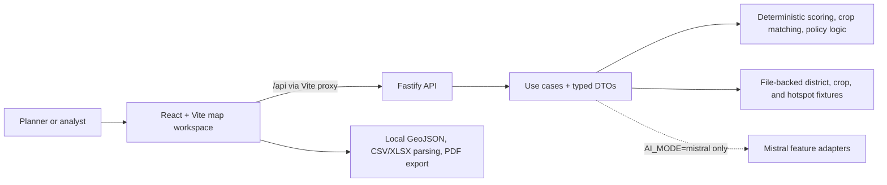

# AgriSmart

**A decision workspace for exploring agricultural risk across Indian districts—turning map-level signals into crop, land, and policy conversations.**

AgriSmart is a full-stack portfolio product built around a practical problem: broad climate and land-risk data is difficult to turn into a useful next question. A user can start on an interactive India map, inspect a district's land-health profile, compare supported time horizons, and move into crop or policy analysis without changing tools.


> **Product mode:** the default setup is local and provider-free. The map, fixture data, deterministic scores, crop matching, and policy checks run without an AI key.

## The workflow

1. **Find a place worth investigating.** Browse district boundaries coloured by degradation risk, or toggle soil and yield hotspot overlays.
2. **Open the district view.** Inspect land-health scores, climate indicators, crop information, and trend charts.
3. **Compare an intervention.** Use the Crop Matchmaker's constraints and ranking, or upload a CSV/XLSX policy sheet for deterministic checks and a reviewable policy workflow.
4. **Add narrative only when needed.** With an explicit server-side Mistral configuration, selected views can request a narrative, crop rationale, policy brief, or time-horizon snapshot.

This is deliberately not a black-box “recommendation engine.” The product keeps the underlying map, local data, scoring inputs, and fallback behavior in the flow so an operator can evaluate the result.

## What a user can do today

| Moment | Product capability | What makes it useful |
| --- | --- | --- |
| Scan the country | MapLibre + deck.gl district map with degradation colouring, labels, hover details, search, and soil/yield hotspot overlays | Moves from a broad spatial view to a district-level question quickly. |
| Understand a district | Digital Twin panel with soil, water, climate, crop-sustainability, and overall health scores; charts and time-horizon UI | Groups otherwise scattered signals in one explorable view. |
| Explore crop fit | Server-side filtering and ranking across temperature, pH, groundwater stress, water efficiency, profit band, drought tolerance, and companion planting rules | Makes the trade-offs behind a crop shortlist inspectable. |
| Review policy data | Browser CSV/XLSX parsing, dynamic schemas, deterministic red flags, policy arbitrage, roadmap generation, review modal, and PDF export | Supports structured review before any AI-generated prose is introduced. |
| Add contextual writing | Optional Mistral-backed land narratives, crop rationales, policy briefs, and time-travel snapshots | Keeps provider use behind a server boundary and retains local fallbacks where implemented. |

## Product decisions worth noticing

### Start with a spatial question, not a dashboard wall

The primary interface is an interactive map because “where should I look?” is the first decision. District selection progressively reveals detail rather than asking users to interpret every metric at once.

### Make deterministic logic the baseline

Health scores, crop ranking, policy red flags, and roadmap generation are testable local logic. AI is an optional explanatory layer, never a prerequisite for the core demo. This supports a credible offline walkthrough and makes the product easier to debug.

### Put AI behind explicit product and cost boundaries

The browser never receives a provider key. `AI_MODE=disabled` is the default and prevents provider calls even if a key is present. Enabling Mistral is a deliberate environment decision, with per-actor and per-tenant request and estimated-cost reservations.

### Be precise about data coverage

The map ships broad India boundary and degradation fixtures, but the deep district panel and API workflows currently have detailed fixtures for **Ahmednagar, Yavatmal, Bathinda, and Mandya**. That is intentional portfolio scope, not a claim of nationwide agronomic coverage.

## Architecture



The API uses a clean split between HTTP interfaces, application use cases and ports, domain services, and infrastructure adapters. The client combines MapLibre and deck.gl for geographic interaction while retaining a focused React component structure.

## Stack

| Area | Technologies |
| --- | --- |
| Product UI | React 18, Vite, MapLibre GL, deck.gl, react-map-gl |
| Decision tools | Papa Parse, read-excel-file, html2pdf.js, committed GeoJSON/CSV/JSON fixtures |
| API | Node.js, Fastify, TypeScript, Zod, Pino |
| Quality | Vitest, ESLint, TypeScript, npm workspaces, GitHub Actions |
| Optional AI | Mistral chat-completions API through server-side feature adapters |

## Run it locally

**Requirements:** Node.js `20.19.0+` and npm `11.9.0+` (the repo records these in `.nvmrc` and `package.json`).

```bash
npm ci
cp .env.example .env
npm run dev
```

Open <http://localhost:5173>. Vite runs the client on `5173` and proxies `/api` to Fastify on `8787`.

### Choose a mode

| Mode | Configuration | Experience |
| --- | --- | --- |
| Local demo (recommended) | Keep `AI_MODE=disabled` | Zero provider calls; map, fixtures, deterministic scores, crop matching, and policy checks remain available. |
| Optional AI | Set `AI_MODE=mistral` and only the required `MISTRAL_FEATURE*_KEY` values | Enables configured narratives/rationales/briefs while core data remains independent of the provider. |
| Shared deployment | Set `AUTH_MODE=token`, `AUTH_TOKENS_JSON`, and an explicit production `CLIENT_ORIGINS` allowlist | Replaces the local demo identity; see the environment template before deployment. |

Useful commands:

```bash
npm run dev     # client and server together
npm test        # workspace Vitest suites
npm run lint    # client, server, and scripts
npm run build   # compile server and produce client build
npm run ci      # lint + tests + build
npm run audit   # npm audit
```

## Quality gates

`npm run ci` is the local release check: it runs linting, both workspace test suites, and production builds. GitHub Actions runs that same command on pushes and pull requests targeting `main`.

Focused tests cover the deterministic pieces that carry product decisions: server-side health scoring and crop matching, plus client-side policy red flags, policy roadmaps, feature scoring, and time-horizon selection.

## API at a glance

All routes are mounted below `/api`.

| Route | Purpose |
| --- | --- |
| `GET /health` | Service health, version, uptime, and timestamp. |
| `GET /hotspots?issue=soil\|yield` | Hotspot GeoJSON, optionally scoped by issue. |
| `GET /districts/:district_id` | Detailed district fixture and calculated health scores. |
| `GET /crops/recommendations/:district_id` | Ranked crop recommendations and companion benefits. |
| `POST /llm/*` | Optional narratives, crop rationale, policy brief/freeform analysis, and time-horizon snapshot. |

## Security, cost, and limits

- Provider keys stay on the server. The default `AI_MODE=disabled` is fail-closed.
- AI and policy routes resolve request-local actor and tenant context. Shared deployments should use token mode; the blank-token demo identity is rejected in production.
- AI reservations cap request count and estimated cost per actor and tenant in a fixed one-hour, in-process window. Restarts clear those limits; multi-instance deployments need a shared atomic quota store before treating them as an enforcement boundary.
- Policy freeform requests require a scoped idempotency key. Inputs are strictly validated and bounded; Fastify applies a 1 MB body limit and route rate limiting.
- Local fixtures support a realistic demo, not professional agronomic advice, comprehensive live data, or a production identity/quota service. Validate high-impact crop or policy decisions with qualified, current sources.

## License

Copyright © 2026 Karthik Ramesh. See [LICENSE](LICENSE). Source is available for portfolio review; no permission to copy, modify, distribute, or use it commercially is granted.
